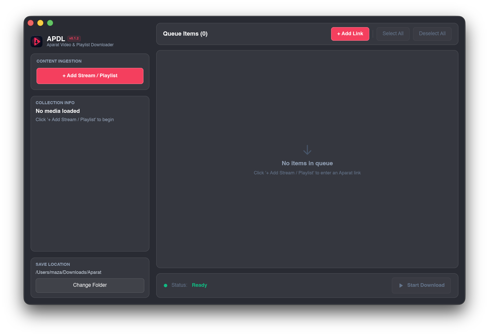

# APDL — Aparat Downloader (`ap-dl`)

[-orange.svg?logo=rust&logoColor=white)](https://www.rust-lang.org/)

A fast, lightweight desktop application built with **Rust**, **Slint UI**, and **Tokio** for high-speed video and batch playlist downloading from [Aparat](https://www.aparat.com).

  

---

## 📥 Downloads (Latest Release)

| Platform | Architecture | Format | Download Link |
| :--- | :--- | :--- | :--- |
|  | **Apple Silicon (ARM64)** | `.dmg` | [⬇️ **Download for macOS**](https://github.com/Mazafard/ap-dl/releases/latest/download/ap-dl-macos-arm64.dmg) |
|  | **Windows (x64)** | `.zip` | [⬇️ **Download for Windows**](https://github.com/Mazafard/ap-dl/releases/latest/download/ap-dl-windows-x64.zip) |
|  | **Linux (x86_64)** | `.tar.gz` | [⬇️ **Download for Linux**](https://github.com/Mazafard/ap-dl/releases/latest/download/ap-dl-linux-x64.tar.gz) |

> 💡 *Download links automatically point to the latest stable release.*

---

> [!IMPORTANT]
> ### ⚠️ Educational & Non-Commercial Disclaimer
> This project was developed strictly for learning and educational purposes (Rust async patterns, Tokio runtime, HTTP range streaming, and Slint GUI). It is not affiliated with, endorsed by, or associated with Aparat or Saba Idea.

---

## 🚀 Key Features

- ⚡ **Multi-Segment Turbo Downloader**: Parallel chunk streaming via HTTP `Range` requests for maximum bandwidth saturation.
- 🔁 **Resumable Downloads**: Automatically recovers interrupted or paused downloads from the exact byte without restarting.
- 📋 **Batch Playlist Extraction**: Resolves entire playlist URLs into queued batch downloads with one click.
- 🎯 **Quality Selector**: Full resolution selection (1080p, 720p, 480p, 360p, 240p, 144p) with live metadata preview.
- 🌐 **Intelligent CDN Failover**: Auto-routes through alternative CDN edge mirrors if an endpoint experiences throttling or timeouts.
- 🔄 **In-App Self-Updater**: Background update checking and atomic in-place binary upgrades (`self-replace`) without manual reinstalling.
- 🖥️ **Native Cross-Platform GUI**: High-performance GPU-rendered desktop interface built with Slint for macOS, Windows, and Linux.

---

## 🛠 Makefile Automation

| Command | Description |
| :--- | :--- |
| **`make watch`** | Run development mode with hot-reloading |
| **`make run`** | Run local release build (`cargo run --release`) |
| **`make build`** | Build optimized release binary |
| **`make app`** | Package macOS native `.app` bundle in `dist/` |
| **`make dmg`** | Create macOS `.dmg` installer |
| **`make test`** | Run full test suite |
| **`make release VERSION=0.3.1`** | Bump version, tag, and trigger multi-platform CI/CD release |

---

## 👥 Author

Developed with ❤️ by **Mohammadreza A. Fard** ([@Mazafard](https://github.com/Mazafard))  
- **Issues**: [https://github.com/Mazafard/ap-dl/issues](https://github.com/Mazafard/ap-dl/issues)
- **Repository**: [https://github.com/Mazafard/ap-dl](https://github.com/Mazafard/ap-dl)
